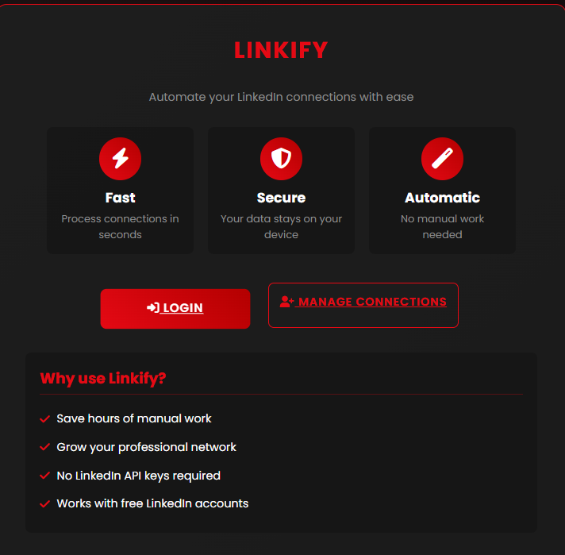

# Linkify - LinkedIn Automation Tool

A secure and efficient web-based tool for automating LinkedIn connection management. Built with Flask and Selenium, Linkify provides a user-friendly interface for managing your professional network.



## Live Demo

**Visit the application:** [https://linkify-mjyp.onrender.com/](https://linkify-mjyp.onrender.com/)

## Overview

Linkify streamlines the process of managing LinkedIn connections by providing automated tools for accepting connection requests. The application features a modern, responsive web interface with secure authentication and session management.

## Key Features

- **Secure Authentication**: LinkedIn login with OTP verification support
- **Automated Connection Management**: Accept pending connection requests automatically
- **Session Persistence**: Save and reuse session cookies to minimize repeated logins
- **Responsive Web Interface**: Modern, mobile-friendly design
- **Headless Browser Support**: Optimized for cloud deployment and automation
- **Real-time Statistics**: Monitor connection status and pending requests

## Technology Stack

- **Backend**: Flask (Python)
- **Frontend**: HTML5, CSS3, JavaScript
- **Browser Automation**: Selenium WebDriver
- **Deployment**: Render (Cloud Platform)
- **Styling**: Custom CSS with modern design principles

## Installation

### Prerequisites

- Python 3.11 or higher
- pip package manager

### Setup Instructions

1. **Clone the repository**
   ```bash
   git clone https://github.com/sachinskyte/Linkify.git
   cd Linkify
   ```

2. **Install dependencies**
   ```bash
   pip install -r requirements.txt
   ```

3. **Run the application**
   ```bash
   python app.py
   ```

4. **Access the application**
   Open your browser and navigate to `http://127.0.0.1:5000`

## Project Structure

```
Linkify/
├── app.py                  # Main Flask application
├── requirements.txt        # Python dependencies
├── render.yaml            # Render deployment configuration
├── static/                # Static assets
│   ├── css/              # Stylesheets
│   ├── js/               # JavaScript files
│   └── linkify-screenshot.png
├── templates/             # HTML templates
├── scripts/               # Utility scripts
└── cookies/               # Session storage
```

## Usage

1. **Access the Application**: Navigate to the web interface
2. **Login**: Use your LinkedIn credentials to authenticate
3. **Manage Connections**: View and process pending connection requests
4. **Monitor Progress**: Track connection statistics and automation status

## Security & Privacy

- **Local Data Storage**: Session cookies are stored locally on the server
- **No Data Collection**: The application does not collect or store personal information
- **Secure Sessions**: Implemented with proper session management and security headers
- **Educational Use**: Designed for learning and personal use only

## Deployment

The application is configured for deployment on Render with the following features:

- **Automatic Deployment**: Connected to GitHub repository
- **Health Checks**: Built-in monitoring and health endpoints
- **Production Configuration**: Optimized for cloud deployment
- **Environment Variables**: Secure configuration management

## Development

### Local Development

1. Set up a virtual environment:
   ```bash
   python -m venv venv
   source venv/bin/activate  # On Windows: venv\Scripts\activate
   ```

2. Install development dependencies:
   ```bash
   pip install -r requirements.txt
   ```

3. Run in development mode:
   ```bash
   python app.py
   ```

### Contributing

1. Fork the repository
2. Create a feature branch
3. Make your changes
4. Submit a pull request

## License

This project is licensed under the MIT License. See the LICENSE file for details.

## Disclaimer

This tool is provided for educational purposes only. Users are responsible for complying with LinkedIn's Terms of Service and applicable laws. The developers are not responsible for any misuse of this application.

## Support

- **GitHub Issues**: [Report bugs or request features](https://github.com/sachinskyte/Linkify/issues)
- **Documentation**: Check the code comments and inline documentation
- **Community**: Join discussions in the GitHub repository

## Author

**Sachin Patel** - [LinkedIn](https://www.linkedin.com/in/sachinskyte/) | [GitHub](https://github.com/sachinskyte)

---

*Built with modern web technologies and best practices for secure, scalable automation.*


